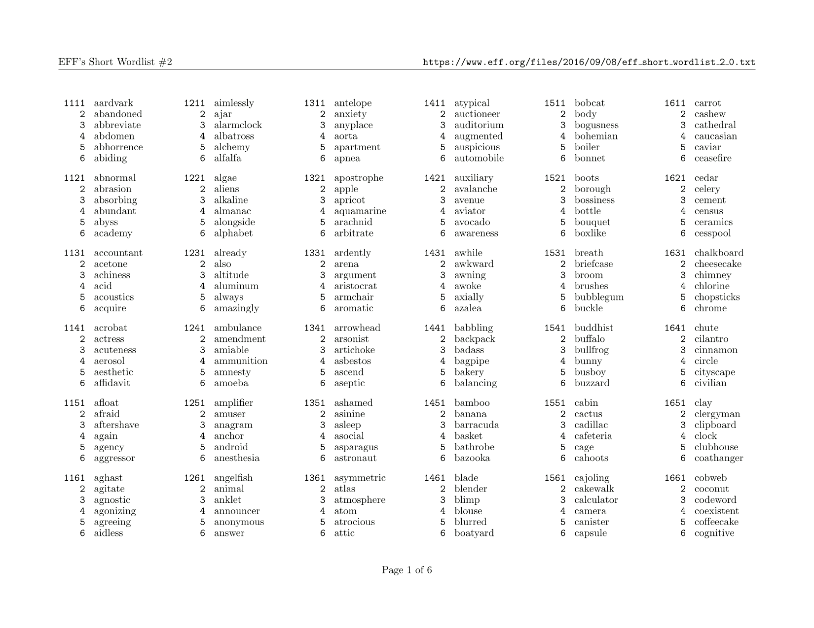

# EFF’s Short Wordlists for printing

EFF’s Short Wordlists are lists of words (duh!) made for passphrase generation with dice. Read more at [EFF Dice-Generated Passphrases](https://www.eff.org/dice).

In this repo you'll find those lists typeset in LaTeX. ready for printing.

Sample page:
  

# Credits

Typeset by André Kugland &lt;kugland@gmail.com&gt;.
  
# License

The LaTeX/AWK code is released under the MIT license.

I’m not sure about the lists. But EFF certainly wouldn’t release those under a non-free license. :-)
